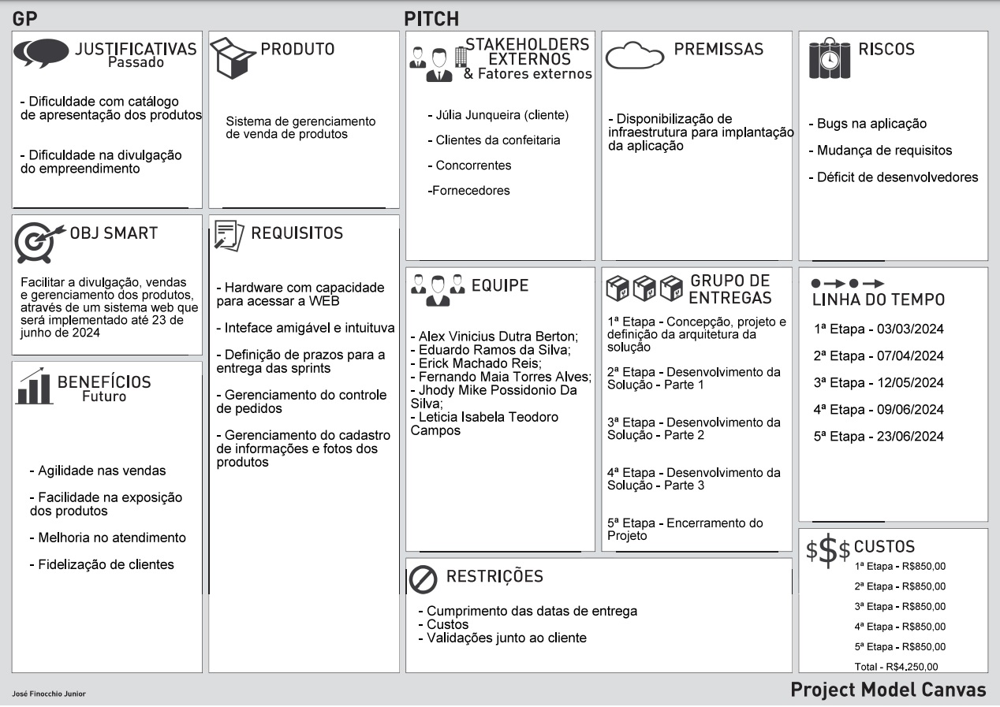
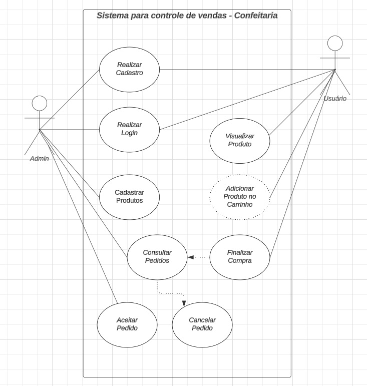
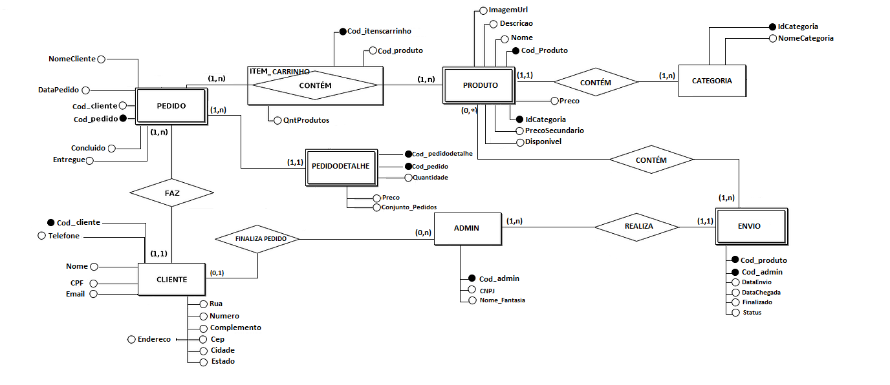
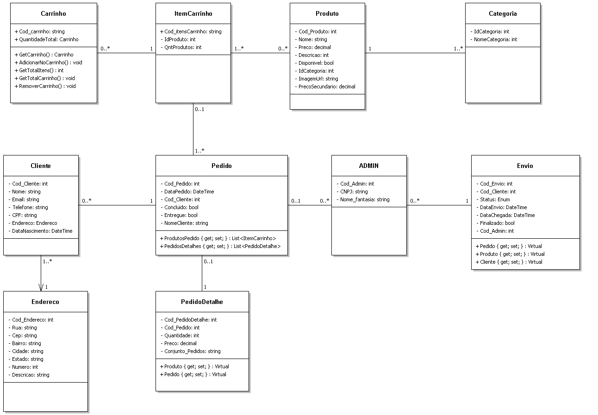

# Especificações do Projeto

Pré-requisitos: <a href="1-Documentação de Contexto.md"> Documentação de Contexto</a>

Definição do problema e ideia de solução a partir da perspectiva do usuário. É composta pela definição do  diagrama de personas, histórias de usuários, requisitos funcionais e não funcionais além das restrições do projeto.

Apresente uma visão geral do que será abordado nesta parte do documento, enumerando as técnicas e/ou ferramentas utilizadas para realizar a especificações do projeto

## Arquitetura e Tecnologias

Para este projeto, optamos pelas seguintes tecnologias e arquitetura:

### Tecnlogias: 
- Linguagem de Programação: C#
- Framework: ASP.NET
- Banco de Dados: SQL Server

### Arquitetura:

  
## Project Model Canvas

Colocar a imagem do modelo construído apresentando a proposta de solução.

> **Links Úteis**:
> Disponíveis em material de apoio do projeto

## Requisitos

As tabelas que se seguem apresentam os requisitos funcionais e não funcionais que detalham o escopo do projeto. Para determinar a prioridade de requisitos, aplicar uma técnica de priorização de requisitos e detalhar como a técnica foi aplicada.

### Requisitos Funcionais

|ID    | Descrição do Requisito  | Prioridade |
|------|-----------------------------------------|----|
|RF-001| A aplicação deve permitir o usuário se cadastrar. | Alta | 
|RF-002| A aplicação deve permitir o usuário realizar login.   | Alta |
|RF-003| A aplicação deve permitir ao usuário EDITAR dados pessoais.   | Média |
|RF-004| A aplicação deve permitir ao usuário navegar pelas páginas.  | Alta |
|RF-005| A aplicação deve permitir ao usuário realizar BUSCAS de produtos.  | Baixa |
|RF-006| A aplicação deve permitir o usuário selecionar produtos.  | Alta |
|RF-007| A aplicação deve permitir o usuário adicionar produtos ao carrinho.   | Alta |
|RF-008| A aplicação deve permitir ao usuário finalizar a compra de um ou mais produtos.  | Alta |
|RF-009| A aplicação deve permitir ao usuário acessar os pedidos realizados por ele.  | Média |
|RF-010| A aplicação deve possuir filtro de categoria.   | Média |
|RF-011| A aplicação deve ter um mecanismo que verifica se o pedido é possível, considerando a data e a quantidade desejada.   | Alta |
|RF-012| A aplicação deve permitir somente ao administrador do site adicionar produtos para venda | Alta |
|RF-013| A aplicação deve permitir somente ao administrador do site editar produtos | Alta |
|RF-014| A aplicação deve permitir somente ao administrador do site excluir produtos ou indisponibilizá-los | Alta |
|RF-015| A aplicação deve permitir somente ao administrador do site adicionar categorias de produtos | Alta |
|RF-016| A aplicação deve permitir somente ao administrador do site editar categorias de produtos | Alta |
|RF-017| A aplicação deve permitir somente ao administrador do site excluir categorias de produtos | Alta |
|RF-018| A aplicação deve permitir somente ao administrador do site visualizar as informações de todos os seu clientes | Média |
|RF-019| A aplicação deve permitir somente ao administrador do site relatar que um pedido já foi entregue ou concluído | Alta |
|RF-020| A aplicação deve notificar o usuário que o pedido está a caminho | Baixa |
|RF-021| A aplicação deve permitir o usuário recuperar sua senha | Baixa |

### Requisitos não Funcionais

|ID     | Descrição do Requisito  |Prioridade |
|-------|-------------------------|----|
|RNF-001| A aplicação web deve ser responsiva | Média | 
|RNF-002| A aplicação deve registrar eventos importantes, erros e atividades críticas para fins de auditoria, solução de problemas e segurança.| Alta | 
|RNF-003| A aplicação deve ser capaz de lidar com um aumento repentino no tráfego, especialmente durante períodos de alta demanda, como feriados ou promoções especiais. | Alta |
|RNF-004| A aplicação deve implementar autenticação baseada em tokens JWT (JSON Web Tokens) | Média |
|RNF-005| A aplicação deve implemementar autorização com base no serviço do EntityFramework Identity |  Média | 
|RNF-006| A aplicação deve ser compatível com os principais navegadores web (Chrome, Firefox, Safari, Edge) | Média |
|RNF-007| A aplicação deve ter uma interface intuitiva e de fácil utilização | Alta |
|RNF-008| Deve ser implementado um processo eficiente de atualizações e manutenção da produtos, garantindo que novos produtos sejam implementadas de forma segura e sem impactar a disponibilidade da aplicação. | Média |
|RNF-009| A aplicação deve ser eficiente em termos de consumo de recursos, como CPU, memória e largura de banda, para otimizar os custos de hospedagem na Azure. | Alta |

Com base nas Histórias de Usuário, enumere os requisitos da sua solução. Classifique esses requisitos em dois grupos:

- [Requisitos Funcionais
 (RF)](https://pt.wikipedia.org/wiki/Requisito_funcional):
 correspondem a uma funcionalidade que deve estar presente na
  plataforma (ex: cadastro de usuário).
- [Requisitos Não Funcionais
  (RNF)](https://pt.wikipedia.org/wiki/Requisito_n%C3%A3o_funcional):
  correspondem a uma característica técnica, seja de usabilidade,
  desempenho, confiabilidade, segurança ou outro (ex: suporte a
  dispositivos iOS e Android).
Lembre-se que cada requisito deve corresponder à uma e somente uma
característica alvo da sua solução. Além disso, certifique-se de que
todos os aspectos capturados nas Histórias de Usuário foram cobertos.

## Restrições

O projeto está restrito pelos itens apresentados na tabela a seguir.

|ID| Restrição                                             |
|--|-------------------------------------------------------|
| RE-01	| O projeto deverá ser entregue no final do semestre letivo. | 
| RE-02	| A equipe não pode subcontratar o desenvolvimento do trabalho. |
| RE-03	| A aplicação só poderá ser lançada se os requisitos de funcionalidade e acessibilidade quando forem atendidas. |
| RE-04 | Não é permitido a remuneração financeira para a equipe durante a execução deste trabalho acadêmico. |
| RE-05 | As tecnologias ou software utilizados no projeto devem estar em conformidade com licenças específicas (por exemplo, licenças de código aberto) e não podem infringir direitos autorais ou licenças. |

Enumere as restrições à sua solução. Lembre-se de que as restrições geralmente limitam a solução candidata.

> **Links Úteis**:
> - [O que são Requisitos Funcionais e Requisitos Não Funcionais?](https://codificar.com.br/requisitos-funcionais-nao-funcionais/)
> - [O que são requisitos funcionais e requisitos não funcionais?](https://analisederequisitos.com.br/requisitos-funcionais-e-requisitos-nao-funcionais-o-que-sao/)

## Diagrama de Casos de Uso

O diagrama de casos de uso é um modelo gráfico e uma tabela com as descrições sucintas dos casos de uso e dos atores.

## Modelo ER (Projeto Conceitual)

O Modelo ER representa através de um diagrama como as entidades (coisas, objetos) se relacionam entre si na aplicação interativa.

## Projeto da Base de Dados

Diagrama de classes representando o projeto do banco de dados e o relacionamento entre entidades.

