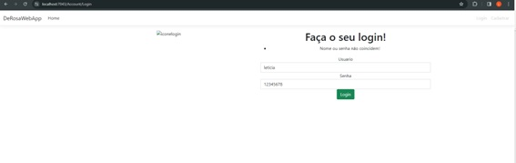

# Planos de Testes de Software

Apresente os cenários de testes utilizados na realização dos testes da sua aplicação. Escolha cenários de testes que demonstrem os requisitos sendo satisfeitos.

Enumere quais cenários de testes foram selecionados para teste. Neste tópico o grupo deve detalhar quais funcionalidades avaliadas, o grupo de usuários que foi escolhido para participar do teste e as ferramentas utilizadas.

Os requisitos para realização dos testes de software são:
- Aplicação rodando no ambiente local. 

Os testes funcionais a serem realizados na aplicação são descritos a seguir.

Plano de Testes: Funcionalidade de Login

|Caso de teste   | CT-01 - Teste de Cadastro de Novo Usuário:
|------|-----------------------------------------|
|Requisitos associados | RF-01​​  A aplicação deve permitir o usuário se cadastrar.
|Objetivo do teste | O sistema deve permitir cadastro de novos usuários. 
|Passos | <ol><li> Acessar o painel de controle. </li> <li> Clicar no botão "Criar Nova Conta". </li> <li> Preencher os campos obrigatórios. </li> <li>Clicar no botão "Salvar". </li> </ol>
|Critérios de Êxito | <ul> <li>A nova conta deve ser criada com sucesso e aparecer na lista de contas. </li>  

 

 

|Caso de teste   | CT-02 - Teste de Login com Credenciais Válidas:
|------|-----------------------------------------|
|Requisitos associados | RF-02​​  A aplicação deve permitir o usuário realizar login.
|Objetivo do teste | O sistema deve permitir o acesso do usuário. 
|Passos | <ol><li> Acessar a página de login. </li> <li> Inserir um nome de usuário e senha válidos. </li> <li> Clicar no botão de login. </li></ol>
|Critérios de Êxito | <ul> <li> Aparecer mensagem de êxito ao realizar login </li> 

 

|Caso de teste   | CT-03 - Teste de Login com Credenciais Inválidas:
|------|-----------------------------------------|
|Requisitos associados | RF-01​2  A aplicação deve permitir o usuário realizar login.
|Objetivo do teste | O sistema não permitir o acesso com credenciais inválidas. 
|Passos | <ol><li> Acessar a página de login. </li> <li> Inserir um nome de usuário e senha inválidos. </li> <li> Clicar no botão de login. </li></ol>
|Critérios de Êxito | <ul> <li>O sistema deve exibir uma mensagem de erro informando que as credenciais são inválidas. </li> 

 
 
# Evidências de Testes de Software

Apresente imagens e/ou vídeos que comprovam que um determinado teste foi executado, e o resultado esperado foi obtido. Normalmente são screenshots de telas, ou vídeos do software em funcionamento.

### CT-01 - Teste de Cadastro de Novo Usuário

No primeiro momento foi retornado um erro, mostrado a seguir, mas o erro foi corrigido e o usuário foi cadastrado com sucesso

### CT-01 - CT-21 - Teste de Login com Credenciais Válidas

### CT-03 - Teste de Login com Credenciais Inválidas

