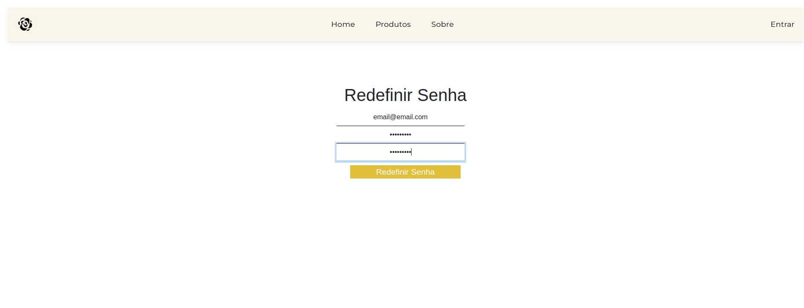
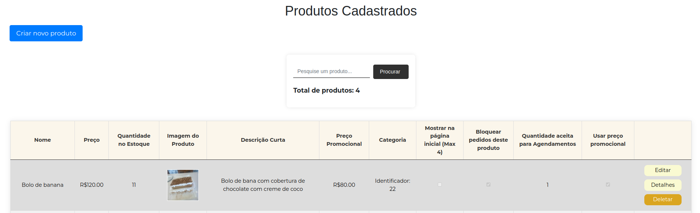
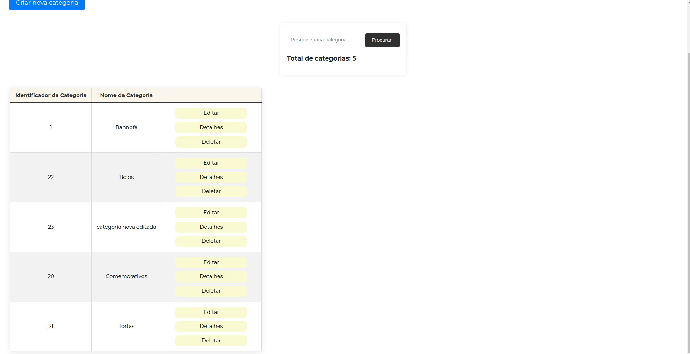

# Planos de Testes de Software

Apresente os cenários de testes utilizados na realização dos testes da sua aplicação. Escolha cenários de testes que demonstrem os requisitos sendo satisfeitos.

Enumere quais cenários de testes foram selecionados para teste. Neste tópico o grupo deve detalhar quais funcionalidades avaliadas, o grupo de usuários que foi escolhido para participar do teste e as ferramentas utilizadas.

Os requisitos para realização dos testes de software são:
- Aplicação rodando no ambiente local. 

Os testes funcionais a serem realizados na aplicação são descritos a seguir.

Plano de Testes: Funcionalidade de Login

|Caso de teste   | CT-01 - Teste de Cadastro de Novo Usuário:
|------|-----------------------------------------|
|Requisitos associados | RF-01​​  A aplicação deve permitir o usuário se cadastrar.
|Objetivo do teste | O sistema deve permitir cadastro de novos usuários. 
|Passos | <ol><li> Acessar o painel de controle. </li> <li> Clicar no botão "Criar Nova Conta". </li> <li> Preencher os campos obrigatórios. </li> <li>Clicar no botão "Salvar". </li> </ol>
|Critérios de Êxito | <ul> <li>A nova conta deve ser criada com sucesso e aparecer na lista de contas. </li>  

 

 

|Caso de teste   | CT-02 - Teste de Login com Credenciais Válidas:
|------|-----------------------------------------|
|Requisitos associados | RF-02​​  A aplicação deve permitir o usuário realizar login.
|Objetivo do teste | O sistema deve permitir o acesso do usuário. 
|Passos | <ol><li> Acessar a página de login. </li> <li> Inserir um nome de usuário e senha válidos. </li> <li> Clicar no botão de login. </li></ol>
|Critérios de Êxito | <ul> <li> Aparecer mensagem de êxito ao realizar login </li> 

 

|Caso de teste   | CT-03 - Teste de Login com Credenciais Inválidas:
|------|-----------------------------------------|
|Requisitos associados | RF-0​2  A aplicação deve permitir o usuário realizar login.
|Objetivo do teste | O sistema não permitir o acesso com credenciais inválidas. 
|Passos | <ol><li> Acessar a página de login. </li> <li> Inserir um nome de usuário e senha inválidos. </li> <li> Clicar no botão de login. </li></ol>
|Critérios de Êxito | <ul> <li>O sistema deve exibir uma mensagem de erro informando que as credenciais são inválidas. </li> 

 

|Caso de teste   | CT-04 - Teste de Alteração de Dados do Usuário:
|------|-----------------------------------------|
|Requisitos associados | RF-03  A aplicação deve permitir ao usuário EDITAR dados pessoais.
|Objetivo do teste | O sistema deve permitir que os usuários alterem os dados cadastrados anteriormente. 
|Passos | <ol><li> Acessar a página de login. </li> <li> Relaizar login com credenciais válidas. </li> <li> Clicar em minha conta. </li> <li> Alterar os dados. </li> <li> Clicar em salvar. </li></ol>
|Critérios de Êxito | <ul> <li>O sistema deve alterar os dados antigos para os que o usuário acabou de inserir. </li> 

 

|Caso de teste   | CT-05 - Teste de Navegação pelas páginas.:
|------|-----------------------------------------|
|Requisitos associados | RF-04  A aplicação deve permitir ao usuário navegar pelas páginas.
|Objetivo do teste | O sistema deve permitir que os usuários naveguem pelas páginas do sistema. 
|Passos | <ol><li> Acessar a página de login. </li> <li> Relaizar login com credenciais válidas. </li> <li> Clicar em alguma página. </li> <li> Clicar em outra página. </li></ol>
|Critérios de Êxito | <ul> <li>O sistema deve alterar de página ao clicar. </li> 

 

|Caso de teste   | CT-06 - Teste de Seleção de Produtos.:
|------|------------------------|
|Requisitos associados | RF-06 A aplicação deve permitir o usuário selecionar produtos.
|Objetivo do teste | O sistema deve permitir que os usuários selecionem produtos. 
|Passos | <ol><li> Acessar a página de produtos. </li> <li> Clicar no botão detalhes de algum produto. </li></ol>
|Critérios de Êxito | <ul> <li>O sistema deve abrir uma página com o produto selecionado. </li> 

 

|Caso de teste   | CT-07 - Teste de Adição de Produtos no Carrinho.:
|------|------------------------|
|Requisitos associados | RF-07 A aplicação deve permitir o usuário adicionar produtos ao carrinho.
|Objetivo do teste | O sistema deve permitir que os usuários adicionem produtos ao carrinho. 
|Passos | <ol><li> Acessar a página de produtos. </li> <li> Clicar no botão detalhes de algum produto. </li> <li> Colocar a quantidade desejada do produto. </li> <li> Clicar no botão de adicionar o produto ao carrinho. </li></ol>
|Critérios de Êxito | <ul> <li>O sistema deve adicionar o produto selecionado ao carrinho. </li> 

 

|Caso de teste   | CT-08 - Teste de Finalização de Pedidos.:
|------|------------------------|
|Requisitos associados | RF-08 A aplicação deve permitir ao usuário finalizar a compra de um ou mais produtos.
|Objetivo do teste | O sistema deve permitir que os usuários finalizem a compra. 
|Passos | <ol><li> Adicionar produtos ao carrinho. </li> <li> Acessar o carrinho. </li> <li> Clicar em encerrar Pedido. </li> <li> Selecionar o endereço de entrega. </li> <li> Clicar em Finalizar Pedido. </li> <li> Clicar em Pagar. </li></ol>
|Critérios de Êxito | <ul> <li>O sistema deve processar a compra do usuário corretamente. </li> 

 

 

|Caso de teste   | CT-09 - Teste de visualização dos pedidos feitos.:
|------|------------------------|
|Requisitos associados | RF-09 A aplicação deve permitir ao usuário acessar os pedidos realizados por ele.
|Objetivo do teste | O sistema deve permitir que os usuários visualizar os pedidos feitos por ele. 
|Passos | <ol><li> Acessar a página Meus Pedidos. </li> <li> Visualizar os pedidos realizados. </li> 
|Critérios de Êxito | <ul> <li>O sistema deve exibir os pedidos do usuário. </li> 

 

 

|Caso de teste   | CT-10 - Teste de visualização de categorias de produtos.:
|------|------------------------|
|Requisitos associados | RF-10 A aplicação deve possuir filtro de categoria.
|Objetivo do teste | O sistema deve permitir que os usuários filtrem os produtos por categorias. 
|Passos | <ol><li> Acessar a página Produtos. </li> <li> Visualizar os filtros na lateral esquerda da página. </li> 
|Critérios de Êxito | <ul> <li>O sistema deve exibir os produtos de acordo com os filtros. </li> 

 

 

|Caso de teste   | CT-11 - Teste de Verificação de Pedidos.:
|------|------------------------|
|Requisitos associados | RF-11 A aplicação deve ter um mecanismo que verifica se o pedido é possível, considerando a data e a quantidade desejada..
|Objetivo do teste | O sistema não deve permitir que os usuários adicionem produtos ao carrinho caso não tenha a quantidade desejada por ele. 
|Passos | <ol><li> Acessar a página Produtos. </li> <li> Selecionar o produto. </li> <li> Selecionar uma quantidade maior que o disponível. </li> <li> Tentar adicionar o produto ao carrinho. </li> 
|Critérios de Êxito | <ul> <li>O sistema deve exibir uma mensagem de erro. </li> 

 

|Caso de teste   | CT-12 - Teste Recuperação de Senha.:
|------|------------------------|
|Requisitos associados | RF-21 A aplicação deve permitir o usuário recuperar sua senha.
|Objetivo do teste | O sistema deve permitir que os usuários recuperem sua senha caso a esqueçam. 
|Passos | <ol><li> Acessar a página Login. </li> <li> Clicar em Esqueci Senha. </li> <li> Preencher com o email e clicar em enviar. </li> <li> Clicar no link enviado para o email. </li> <li> Clicar no link enviado para o email. </li> <li> Preencher os campos com a nova senha e clicar em enviar. </li> 
|Critérios de Êxito | <ul> <li>O sistema deve alterar a senha do usuário. </li> 

 

|Caso de teste   | CT-13 - Teste Adição de Produtos.:
|------|------------------------|
|Requisitos associados | RF-12 A aplicação deve permitir somente ao administrador do site adicionar produtos para venda
|Objetivo do teste | O sistema deve permitir que o administrador adicione produtos para a venda. 
|Passos | <ol><li> Fazer Login como administrador. </li> <li> Acessar a página Área de administração. </li> <li> Clicar em Produtos. </li> <li> Clicar em Criar Novo Produto. </li> <li> Preencher os dados do novo produto. </li> <li> Clicar em Salvar. </li> 
|Critérios de Êxito | <ul> <li>O sistema deve salvar o novo produto cadastrado. </li> 

 

|Caso de teste   | CT-14 - Teste Edição de Produtos.:
|------|------------------------|
|Requisitos associados | RF-13 A aplicação deve permitir somente ao administrador do site editar produtos
|Objetivo do teste | O sistema deve permitir que o administrador edite produtos cadastrados. 
|Passos | <ol><li> Fazer Login como administrador. </li> <li> Acessar a página Área de administração. </li> <li> Clicar em Produtos. </li> <li> Clicar em Editar. </li> <li> Alterar os dados/imagem do produto. </li> <li> Clicar em Salvar. </li> 
|Critérios de Êxito | <ul> <li>O sistema deve alterar os dados do produto cadastrado. </li> 

 

|Caso de teste   | CT-15 - Teste Deleção de Produtos.:
|------|------------------------|
|Requisitos associados | RF-14 A aplicação deve permitir somente ao administrador do site excluir produtos
|Objetivo do teste | O sistema deve permitir que o administrador exclua produtos cadastrados. 
|Passos | <ol><li> Fazer Login como administrador. </li> <li> Acessar a página Área de administração. </li> <li> Clicar em Produtos. </li> <li> Clicar em Deletar. </li> <li> Clicar em excluir. </li>
|Critérios de Êxito | <ul> <li>O sistema deve excluir o produto cadastrado. </li> 

 

|Caso de teste   | CT-16 - Teste Adição de Categoria.:
|------|------------------------|
|Requisitos associados | RF-15 A aplicação deve permitir somente ao administrador do site adicionar categorias de produtos
|Objetivo do teste | O sistema deve permitir que o administrador adicione categorias de produtos. 
|Passos | <ol><li> Fazer Login como administrador. </li> <li> Acessar a página Área de administração. </li> <li> Clicar em Categorias. </li> <li> Clicar em Criar Nova Categoria. </li> <li> CPreencher o nome da categoria e clicar em Criar. </li>
|Critérios de Êxito | <ul> <li>O sistema deve adicionar a nova categoria. </li>

 

|Caso de teste   | CT-17 - Teste Edição de Categoria.:
|------|------------------------|
|Requisitos associados | RF-16 A aplicação deve permitir somente ao administrador do site editar categorias de produtos
|Objetivo do teste | O sistema deve permitir que o administrador edite categorias de produtos. 
|Passos | <ol><li> Fazer Login como administrador. </li> <li> Acessar a página Área de administração. </li> <li> Clicar em Categorias. </li> <li> Clicar em Editar. </li> <li> Preencher o nome da categoria e clicar em Salvar. </li>
|Critérios de Êxito | <ul> <li>O sistema deve editar categoria. </li>

 

|Caso de teste   | CT-18 - Teste Exclusão de Categoria.:
|------|------------------------|
|Requisitos associados | RF-17 A aplicação deve permitir somente ao administrador do site excluir categorias de produtos
|Objetivo do teste | O sistema deve permitir que o administrador exclua categorias de produtos. 
|Passos | <ol><li> Fazer Login como administrador. </li> <li> Acessar a página Área de administração. </li> <li> Clicar em Categorias. </li> <li> Clicar em Deletar. </li> <li> Clicar em Deletar. </li>
|Critérios de Êxito | <ul> <li>O sistema deve excluir a categoria. </li>

 

|Caso de teste   | CT-19 - Teste Conclusão do Pedido.:
|------|------------------------|
|Requisitos associados | RF-19 A aplicação deve permitir somente ao administrador do site relatar que um pedido já foi entregue ou concluído
|Objetivo do teste | O sistema deve permitir que o administrador finalize ou conclua um pedido. 
|Passos | <ol><li> Fazer Login como administrador. </li> <li> Acessar a página Área de administração. </li> <li> Clicar em Pedidos. </li> <li> Clicar em Editar. </li> <li> Marcar os campos Já foi Entregue ou Já foi Preparado. </li> <li> Clicar em Salvar. </li>
|Critérios de Êxito | <ul> <li>O sistema deve mostrar que o pedido já foi preparado e/ou concluído. </li>

 

Os testes unitários a serem realizados na aplicação são descritos a seguir.

 

|Caso de teste   | CT-20 - Teste de Cadastro de Novos Produtos:
|------|-----------------------------------------|
|Requisitos associados | RF-01​2  A aplicação deve permitir somente ao administrador do site adicionar produtos para venda
|Objetivo do teste | O sistema deve permitir cadastro de novos produtos. 
|Passos | <ol><li> Acessar a página de login. </li> <li> Inserir dados válidos dos produtos. </li> <li> executar o teste unitário. </li></ol>
|Critérios de Êxito | <ul> <li>O sistema deve rodar o teste com êxito. </li> 

 
 
# Evidências de Testes de Software

Apresente imagens e/ou vídeos que comprovam que um determinado teste foi executado, e o resultado esperado foi obtido. Normalmente são screenshots de telas, ou vídeos do software em funcionamento.

### CT-01 - Teste de Cadastro de Novo Usuário

No primeiro momento foi retornado um erro, mostrado a seguir, mas o erro foi corrigido e o usuário foi cadastrado com sucesso

### CT-02 - Teste de Login com Credenciais Válidas

### CT-03 - Teste de Login com Credenciais Inválidas

 

### CT-04 - Teste de Alteração de Dados do Usuário

### CT-05 - Teste de Navegação pelas páginas

### CT-06 - Teste de Seleção de Produtos

### CT-07 - Teste de Adição de Produtos no Carrinho

### CT-08 - Teste de Adição de Produtos no Carrinho

### CT-09 - Teste de visualização dos pedidos feitos

### CT-10 - Teste de visualização de categorias de produtos

### CT-11 - Teste de Verificação de Pedidos

### CT-12 - Teste Recuperação de Senha

### CT-13 - Teste Adição de Produtos

### CT-14 - Teste Edição de Produtos

### CT-15 - Teste Deleção de Produtos

### CT-16 - Teste Adição de Categoria

### CT-17 - Teste Edição de Categoria

### CT-18 - Teste Exclusão de Categoria

### CT-19 - Teste Conclusão do Pedido

### CT-20 - Teste Unitário de Adição de Novo Produto

